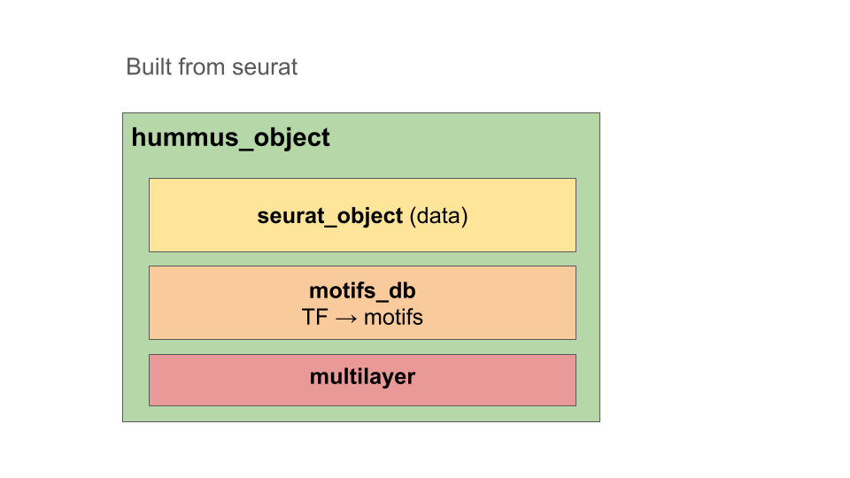

```{r setup, include=FALSE}
knitr::opts_chunk$set(eval = TRUE)
#devtools::install_github("cantinilab/HuMMuS")
```

### General plan
##### 1. Initialisation of a hummus object 
##### 2. Add a new multiplex
##### 3. Add a new bipartite

```{r import_packages}
library(reticulate)
# install python dependency
py_install("hummuspy", envname = "r-reticulate", method="auto")
library(HuMMuS)
```


## 1. Initialisation of HuMMuS object
HuMMuS R objects are instances developed on top of seurat objects. It means it’s created from a seurat object and the contained assays can be accessed the same way.

Additionally, it contains a motifs_db object, providing tf motifs informations, and a multilayer objects, that will be completed while going through this tutorial. It will mostly include :
  - list of multiplex networks (one per modality) 
  - list of bipartites (one per connection between layers)


```{r genome_annotations, warning=FALSE}
# Create an hummus object from seurat object
# Load the Chen dataset, which is a Seurat object containing scRNA-seq and scATAC-seq data
data("chen_dataset_subset")
chen_dataset_subset
hummus <- Initiate_Hummus_Object(chen_dataset_subset)


# wrapper of Signac::GetGRangesFromEnsDb, adapting output to UCSC format
genome_annotations <- get_genome_annotations(
  ensdb_annotations = EnsDb.Hsapiens.v86::EnsDb.Hsapiens.v86)
# Add annotations to peak assay
Signac::Annotation(hummus@assays$peaks) <- genome_annotations
rm(genome_annotations)

# Load TF motifs from JASPAR2020 and chromVARmotifs in hummus object
hummus@motifs_db <- get_tf2motifs() # by default human motifs
```

## 2. Add networks


### 2.1 Add a new multiplex through a network
```{r load_rna_network}
# The networks should be imported as 3 columns data.frame: (source, target, weight)
rna_network_path = "chen_multilayer/multiplex/RNA/RNA_GENIE3.tsv"
rna_network <- read.table(rna_network_path, sep = "\t", header = FALSE)
head(rna_network)
```

```{r add_network_new_multiplex}
hummus <- add_network(
    hummus, rna_network,
    multiplex_name = "RNA",
    network_name = "GENIE3",
    weighted = TRUE,
    verbose = 1)
```

### 2.2 Add a network to an existing multiplex
```{r add_network_existing_multiplex}
hummus <- add_network(
    hummus, rna_network,
    multiplex_name = "RNA",
    network_name = "GENIE3_other",
    weighted = TRUE)
```

### 3 Add external bipartites
Bipartites can be 2 or 3 columns data.frame, depending on if weighted or not.
Bipartites not computed through HuMMuS have to be added directly to the object as below:
```{r load_bipartite_tf_peak}
## Add TF peaks bipartite
atac_rna_path = "chen_multilayer/bipartite/atac_rna.tsv"
atac_rna <- read.table(atac_rna_path, sep = "\t", header = FALSE)
head(atac_rna)
```

```{r add_tf_peak bipartite}
hummus@multilayer@bipartites[["atac_rna"]] <- new("bipartite",
                           "network" = atac_rna,
                           "multiplex_left" = "RNA",
                           "multiplex_right" = "peaks")
```

Display HuMMuS object 
```{r show_hummus}
hummus
hummus@multilayer@multiplex
```


